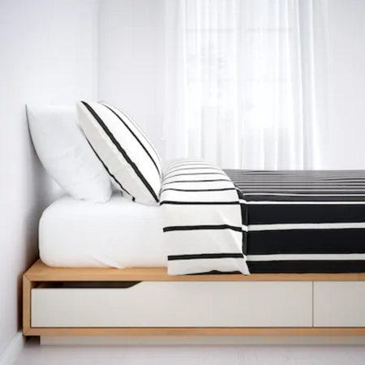

<table>
  <thead>
    <tr>
      <h1 style="background-color: #f00; color: #0000FF; text-align: center;">Camas Ikea</h1>
    </tr>
  </thead>

## "Dormir es importante"

[Motivos](https://github.com/awpzz/zzZ/blob/main/Motivos.md)

### Dormir es un componente vital para el bienestar físico y mental de las personas. Ofrece estos beneficios clave del sueño:

**Reparación y renovación**: Durante el sueño, el cuerpo libera hormonas que ayudan a reparar las células y controlar el uso de energía. Esto es esencial para el crecimiento y desarrollo, especialmente en niños y adolescentes.

**Limpieza cerebral**: El sueño permite la eliminación de residuos tóxicos y la desintoxicación cerebral, lo que ayuda a mantener la salud mental y prevenir el deterioro cognitivo.

**Regulación del estrés**: El sueño ayuda a reducir los niveles de estrés y a equilibrar las hormonas del estrés, lo que a su vez mejora la salud mental y física.

**Mejora de la memoria y aprendizaje**: El sueño es esencial para la consolidación de la memoria y el aprendizaje, ya que durante la fase REM del sueño, el hipocampo restaura y transforma la memoria a corto plazo en memoria a largo plazo.

**Regulación del ritmo circadiano**: El sueño ayuda a sincronizar el ritmo circadiano natural del cuerpo con el entorno, lo que es importante para la salud y el bienestar.

**Reparación del corazón y sistema vascular**: El sueño ayuda a descansar el corazón y el sistema vascular, lo que reduce el riesgo de enfermedades cardiovasculares.

**Equilibrio hormonal**: El sueño ayuda a equilibrar los niveles hormonales, lo que es importante para la salud reproductiva y el desarrollo.

**Mejora de la piel**: El sueño produce colágeno, lo que ayuda a reparar y rejuvenecer la piel.
                                  
--------------------------------------------------------------------------------------------------------------------------------------------------------------------------------------------------------------------------------------------
<h2 align="center"> [Camas Ikea](https://www.ikea.com/es/es/cat/camas-bm003/) </h2>

Camas ergonomicas de calidad

Camas supletorias y divanes

--------------------------------------------------------------------------------------------------------------------------------------------------------------------------------------------------------------------------------------------

